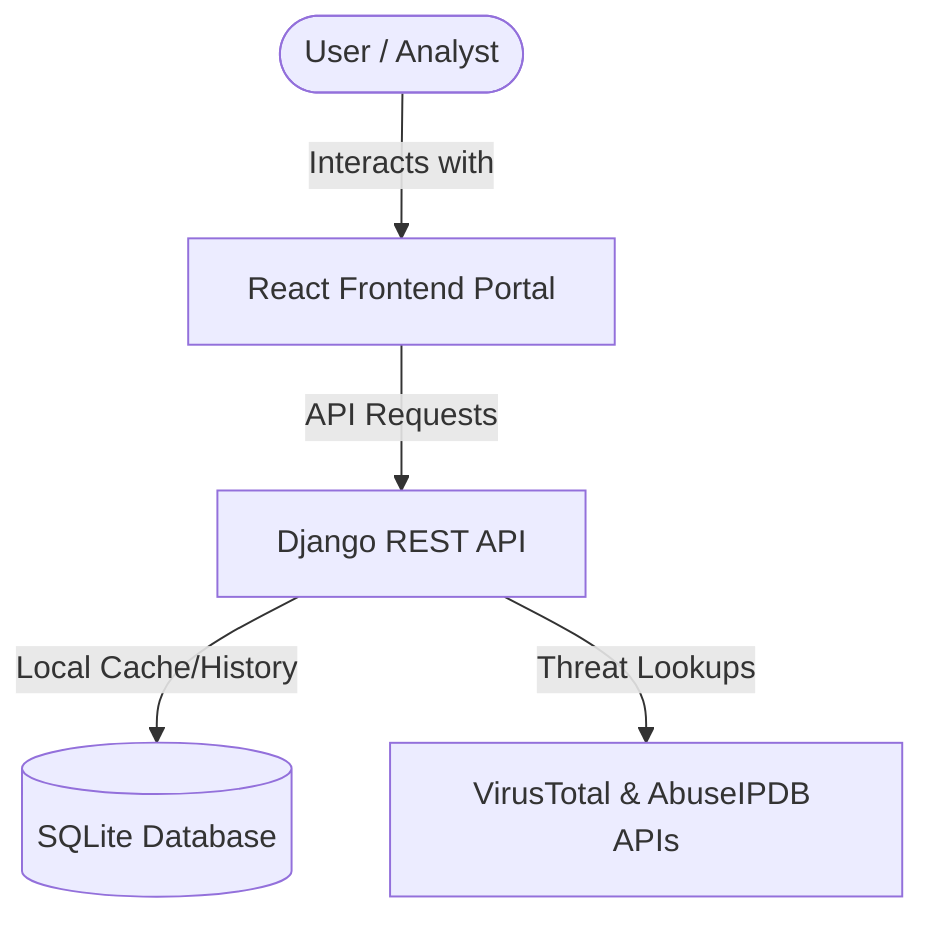

# 👁️ ThreatLens AI

> **Submission for the ATH Hackathon 0.1**  
> Developed with 💻 by Team for ATH Hackathon 0.1.

ThreatLens AI is an intelligent URL, domain, and IP auditing portal. It provides automated heuristic security audits and queries external reputation lookup platforms to detect threats like phishing, malware delivery, and suspicious network patterns—all through a safe, interactive dashboard.

---

## 🎯 Why ThreatLens AI Was Made

This project was built during the **ATH Hackathon 0.1** to address the critical need for safe link auditing. With phishing and credential harvesting on the rise, users often lack a safe way to inspect a link before clicking it. 

ThreatLens AI acts as a protective shield:
*   **SSRF Protection & Safe Resolution:** Resolves target IP addresses safely using blocklists to prevent Server-Side Request Forgery (SSRF).
*   **Static Heuristics:** Evaluates URL patterns, character compositions, and hidden subdomains without requiring active execution of malicious code on the client machine.
*   **Centralized Analytics:** Offers teams and security researchers an educational, central portal to track scanning logs, submit threat ratings, and visualize overall traffic health.

> [!IMPORTANT]
> **Educational & Showcase Project Only**  
> ThreatLens AI is built as a hackathon submission and an educational showcase. For safety precautions and best practices during testing, please review our [SECURITY.md](file:///z:/HACKATHON/SECURITY.md).

---

## 🏗️ Architecture & Tech Stack

ThreatLens AI is organized as a decoupled, multi-tier application:



### 💻 Frontend Portal
*   **React (v18)**: Component-driven, responsive user interface.
*   **Vite**: Lightning-fast build tool and development server.
*   **Tailwind CSS (v3)**: Clean, cyber-themed modern layouts.
*   **Recharts**: High-performance dashboard charts representing threat distributions.
*   **React Router DOM (v6)**: Declarative, client-side routing.
*   *For more details, see the [Frontend README](file:///z:/HACKATHON/frontend/README.md).*

### ⚙️ Backend Service
*   **Python (v3.11+)**
*   **Django (v5.0+)**: Structured database modeling and core application server.
*   **Django REST Framework (DRF)**: Endpoint routing, serializers, rate-limiting, and error handling.
*   **SQLite**: File-based SQL database storing scan histories and user feedback.
*   *For more details, see the [Backend README](file:///z:/HACKATHON/backend/README.md).*

---

## 📂 Repository Structure

```
ThreatLens-AI/
├── backend/                             # Django REST API service
│   ├── api/                             # Threat audit, scans, & feedback logic
│   ├── threatlens_backend/              # Main settings and routing config
│   ├── requirements.txt                 # Backend Python package requirements
│   └── README.md                        # Backend execution documentation
├── frontend/                            # React & Vite client dashboard
│   ├── src/                             # Component pages and API configuration
│   ├── package.json                     # Frontend npm dependencies
│   └── README.md                        # Frontend execution documentation
├── SECURITY.md                          # Hackathon safety policies
└── README.md                            # Global project overview (this file)
```

---

## 🚀 Quick Start & Setup

To run the full ThreatLens AI application locally, follow these steps in order.

### Step 1: Run the Backend Service

1. Open a new terminal in the **`backend/`** directory.
2. Create and activate a Python virtual environment:
   * **Windows (PowerShell):**
     ```powershell
     cd backend
     python -m venv venv
     .\venv\Scripts\Activate.ps1
     ```
   * **Linux/macOS:**
     ```bash
     cd backend
     python -m venv venv
     source venv/bin/activate
     ```
3. Install the dependencies:
   ```bash
   pip install -r requirements.txt
   ```
4. Copy the environment file template:
   ```bash
   copy .env.example .env
   ```
   *(On Linux/macOS, use `cp .env.example .env`)*  
   *Optional: Fill in `VIRUSTOTAL_API_KEY` and `ABUSEIPDB_API_KEY` in `.env`. If left empty, ThreatLens AI fallback heuristics will be used.*
5. Run migrations to setup the database schemas:
   ```bash
   python manage.py migrate
   ```
6. Seed mock threat data for the hackathon showcase:
   ```bash
   python api/seed_demo_data.py
   ```
7. Start the API development server:
   ```bash
   python manage.py runserver 8000
   ```
   The backend will be live at **`http://localhost:8000`**.

---

### Step 2: Run the Frontend Portal

1. Open a new terminal in the **`frontend/`** directory.
2. Install npm packages:
   ```bash
   cd frontend
   npm install
   ```
3. Copy the environment variables configuration:
   ```bash
   copy .env.example .env
   ```
   *(On Linux/macOS, use `cp .env.example .env`)*  
   Ensure the following line is configured to point to your running backend:
   ```ini
   VITE_API_BASE_URL=http://localhost:8000
   ```
4. Run the frontend development server:
   ```bash
   npm run dev
   ```
   The frontend portal will be live at **`http://localhost:5173`**.

---

## 🌐 Production Deployment Summary

*   **Backend:** Can be deployed to platforms like [Render](https://render.com/) or Heroku using Gunicorn and a PostgreSQL database. Remember to set your environment variables (`SECRET_KEY`, `DEBUG=False`, `ALLOWED_HOSTS`, `CORS_ALLOWED_ORIGINS`, `DATABASE_URL`).
*   **Frontend:** Can be deployed to [Vercel](https://vercel.com/) or Netlify using the Vite framework preset. Remember to configure `VITE_API_BASE_URL` pointing to your deployed backend.
*   *Please read the deployment instructions in the [Backend README](file:///z:/HACKATHON/backend/README.md#1-backend-deployment-on-render) for detailed, step-by-step guidance.*
